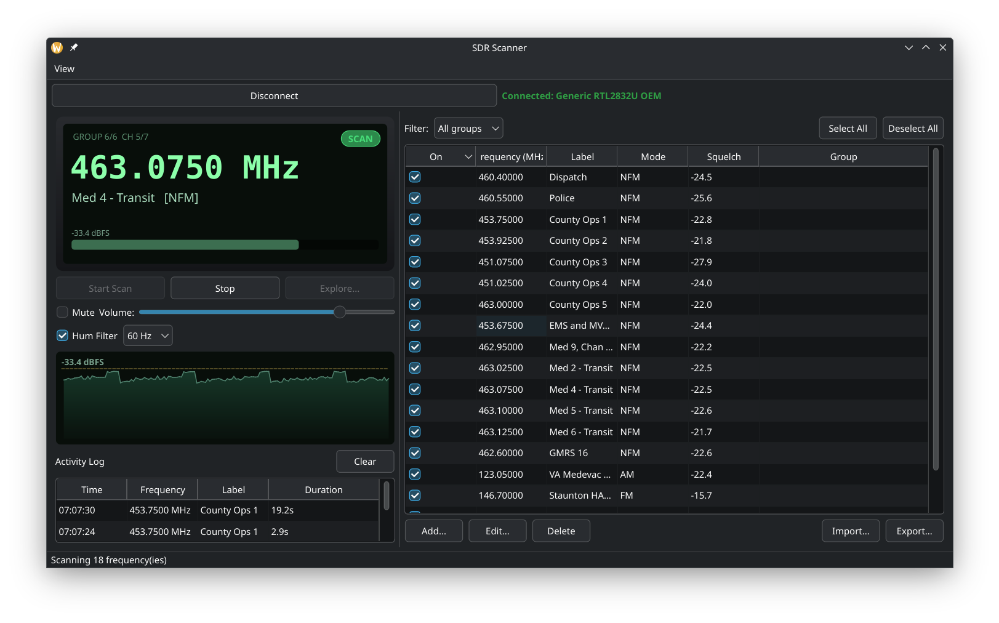

# SDR Scanner

[](https://github.com/JamesBurnettNET/SDR-Scanner/actions/workflows/build.yml)
[](https://github.com/JamesBurnettNET/SDR-Scanner/actions/workflows/release.yml)
[](LICENSE)

A traditional analog-style radio scanner, built on an RTL-SDR (or compatible)
USB dongle instead of dedicated scanner hardware. Pure Qt/C++ — no Python,
no external DSP framework, just Qt6 and `librtlsdr`.



Works with any RTL2832U-based dongle supported by `librtlsdr` — plain
RTL-SDR (V3/V4) and the Nooelec NESDR family (including the V5), which use
the same chipset and driver. Only one device is used at a time, by design.

## Features

- **Grouped scanning.** Frequencies within 2.4MHz of each other are captured
  together in a single wideband tune, and checked for squelch break
  *simultaneously* via a per-channel digital mixer/filter/decimator chain —
  much faster than physically retuning the dongle for every entry in the
  list, since one capture can cover many channels at once.
- **FM / NFM / AM**, with per-frequency squelch — either live auto-squelch
  (which self-adjusts: tightens if it detects chatter/static breaking
  through, loosens during long quiet stretches to try to catch weaker
  signals) or a fixed value from a one-shot **Auto Tune** noise-floor
  measurement.
- **Mains-hum notch filter** — cascaded 50/60Hz (+ harmonics) notch applied
  to demodulated audio, for hum coupled in electrically via USB power/ground
  rather than part of the received signal.
- **Explore mode** — sweep between two frequencies at a custom step, reusing
  the same grouped capture engine.
- **Scanner-style LCD readout** and a live **dBFS signal strip chart**, both
  decoupled from the scan/demod thread (their own repaint timers) so a busy
  display never slows down actual scanning. Toggle either on/off from the
  View menu.
- **Activity log** — one row per completed transmission (time, frequency,
  label, duration), across *every* channel in the currently-tuned capture
  group, not just whichever one is on screen.
- The frequency table **highlights the active row** during a live call, and
  supports Select All / Deselect All (respecting the current group filter).
- **Detect / Connect / Disconnect** device flow: auto-detects on launch;
  Detect reappears any time you're disconnected, so swapping to a different
  SDR is just Disconnect → Detect → pick from the list → Connect.
- Frequency list persists automatically (JSON, autoloads on startup), plus
  CSV/JSON export and JSON import, with free-form group tags for organizing
  and exporting subsets.

## Installing

Pre-built packages are published on the
[Releases page](https://github.com/JamesBurnettNET/SDR-Scanner/releases)
for every tagged version (`v*.*.*`):

| OS | Package |
| --- | --- |
| Debian 13 (trixie) | `sdr-scanner_<version>-1deb13_amd64.deb` |
| Ubuntu 26.04 | `sdr-scanner_<version>-1ub2604_amd64.deb` |
| Fedora 44 | `sdr-scanner-<version>-1.fed44.x86_64.rpm` |

Each package declares its own runtime dependencies (Qt6, librtlsdr, etc.)
automatically via `dpkg-shlibdeps`/RPM's auto-requires, so a normal
`apt install ./sdr-scanner_*.deb` or `dnf install ./sdr-scanner-*.rpm`
resolves everything from the distro's own repos — nothing to hand-install
first.

Windows and macOS aren't packaged/built by CI right now; the source itself
avoids Linux-specific APIs, so building from source may still work there,
just untested.

```bash
# Debian 13 / Ubuntu 26.04
sudo apt install ./sdr-scanner_*.deb

# Fedora 44
sudo dnf install ./sdr-scanner-*.rpm
```

### RTL-SDR USB access

Same as any other RTL-SDR tool: you may need udev rules / `plugdev` group
membership for non-root USB access, and the kernel's competing DVB driver
(`dvb_usb_rtl28xxu`) blacklisted if it grabs the device first.

## Building from source

Requires CMake 3.19+, a C++17 compiler, Qt6 (Widgets + Multimedia), and
`librtlsdr`.

**Debian 13 / Ubuntu 26.04:**

```bash
sudo apt install build-essential cmake qt6-base-dev qt6-multimedia-dev \
                  librtlsdr-dev libusb-1.0-0-dev
```

**Fedora 44:**

```bash
sudo dnf install gcc-c++ cmake qt6-qtbase-devel qt6-qtmultimedia-devel \
                  rtl-sdr-devel libusb1-devel
```

Then:

```bash
cmake -S . -B build -DCMAKE_BUILD_TYPE=Release
cmake --build build -j
```

Run: `./build/sdr-scanner`.

### Building a package locally

```bash
cmake -S . -B build -DCMAKE_BUILD_TYPE=Release -DCPACK_GENERATOR=DEB   # or RPM
cmake --build build -j
cmake --build build --target package   # or: (cd build && cpack)
```

## Architecture notes

- **Grouping**: frequencies are greedily clustered into capture groups
  spanning at most ~2MHz (leaving margin inside the RTL-SDR's 2.4Msps
  capture window for filter roll-off), each tuned once and checked for
  activity on every member frequency from the same capture.
- **Channelizer**: per-channel complex NCO mixer + two-stage FIR
  decimation (2.4Msps → 240kHz → 48kHz), independent of RF offset within
  the group.
- **Threading**: the scan engine owns a dedicated `QThread` running
  librtlsdr's blocking async read loop; retuning always happens *between*
  streaming sessions (never from inside the read callback) to avoid I2C
  timeouts from interleaving tuner control commands with active USB bulk
  streaming. The LCD and signal chart poll a mutex-guarded snapshot on
  their own fixed-rate timers, fully decoupled from the scan thread.

## Credits & acknowledgments

- [**sdrtrunk**](https://github.com/DSheirer/sdrtrunk) (GPLv3) — no code
  was copied, but its FM/AM demodulator implementations were read early on
  to confirm the standard polar-discriminator and magnitude-detector
  algorithms used here. Given that reference, this project is licensed
  GPLv3 as well.
- [**librtlsdr**](https://osmocom.org/projects/rtl-sdr) (GPL-2.0+) — the
  RTL2832U driver this application links against at runtime.

## License

GPLv3 — see [LICENSE](LICENSE). This project links against `librtlsdr`
(GPL-2.0+), which requires a GPL-compatible license for the combined
distributed work.
